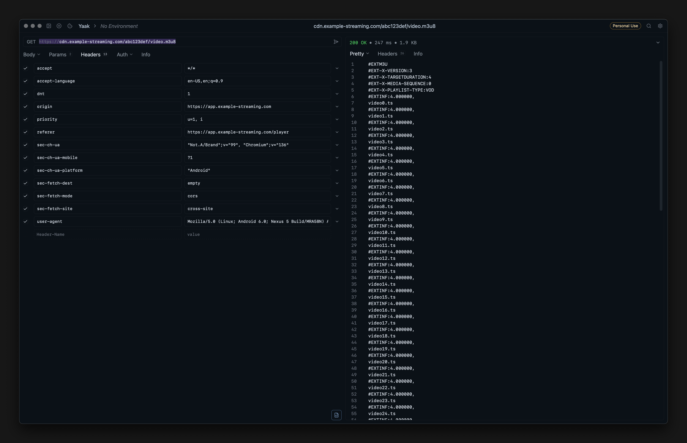

## Introduction

Before I continue, I have to emphazie that **I DO NOT** condone piracy or any illegal activities. This article is purely for educational purposes and should not be used for any illegal activities. Any examples used in this blog post are used with consent and used in my local machine. If yall get caught pirvating im not responsible when yall go to jail ah.

## Ways of Serving Video on the Web

Before we dive into the main content, let’s look at how video is typically delivered online:

### 1. Progressive download
- A single video file (e.g. MP4) sits on a web server or CDN.

- The browser/player starts downloading from the beginning and can play as data arrives.

- Simple to set up, but not adaptive—viewers on slow connections may stall or buffer heavily.

### 2. HTTP Live Streaming (HLS)

- Apple’s protocol based on small segment files (.ts, .aac, etc.) and a playlist (.m3u8).

- Segments are 2–10 seconds long. The player picks the right quality based on bandwidth.

- Perfect for adaptive bitrate streaming and CDN-backed delivery.

- An open standard similar to HLS, is called DASH (Dynamic Adaptive Streaming over HTTP) it uses `.mpd` manifests and fragmented MP4 segments.

### 3. RTMP / WebRTC / RTSP

- Real‐time protocols for low-latency streaming (e.g. live events, conferencing).

- Require specialized servers (nginx-rtmp, Janus, Wowza).

### 4. WebSocket / Media Source Extensions (MSE)

- Self‑hosted custom streaming via JavaScript, where you feed raw segment data into the browser’s media buffer.

- Great for experimental protocols or very low-latency requirements.

In this section we are going to mainly focus on HLS.

## File Download
When you try to fetch an HLS playlist directly, you’ll often run into a “403 Forbidden” error:

```bash
curl -o playlist.m3u8 \
  'https://example.com/link-to-m3u8-file/this-is-a-random-cookie-string/video.m3u8'
```

That’s because the server expects additional context—just like a club bouncer who checks your invitation. To “impersonate” a real browser, you need to replay some of the same headers and cookies your browser sends.

### DevTools & Yaak

You can try to test if the can even be accessible via Yaak.

1. Open DevTools in your browser and go to the Network tab
2. Reload the page and find the request for the `.m3u8` file
3. Right‑click it and Copy → Copy as cURL (bash)
4. Paste into a tool like Yaak to inspect which headers are mandatory.



Now we can do it in the normal cURL command but with some tweaks to impersonate us as a browser.

```bash
curl 'https://example.com/link-to-m3u8-file/this-is-a-random-cookie-string/video.m3u8' \
  -H 'accept: */*' \
  -H 'accept-language: en-US,en;q=0.9' \
  -H 'dnt: 1' \
  -H 'origin: https://example.com' \
  -H 'referer: https://example.com/' \
  -H 'sec-ch-ua: "Not.A/Brand";v="99", "Chromium";v="136"' \
  -H 'sec-ch-ua-mobile: ?1' \
  -H 'sec-ch-ua-platform: "Android"' \
  -H 'sec-fetch-dest: empty' \
  -H 'sec-fetch-mode: cors' \
  -H 'sec-fetch-site: cross-site' \
  -H 'user-agent: Mozilla/5.0 (Linux; Android 6.0; Nexus 5 Build/MRA58N) AppleWebKit/537.36 (KHTML, like Gecko) Chrome/136.0.0.0 Mobile Safari/537.36'
```

If the cookie isn’t already baked into the URL, tack it on manually:

```bash
curl 'https://example.com/link-to-m3u8-file/video.m3u8' \
  ...same headers as above... \
  -H 'Cookie: this-is-a-random-cookie'
```


## Download & Merge the Segments

After you’ve successfully fetched playlist.m3u8, it might look like this:

```bash
#EXTM3U
#EXT-X-VERSION:3
#EXT-X-TARGETDURATION:4
#EXTINF:4.000000,
video0.ts
#EXTINF:4.000000,
video1.ts
…
#EXTINF:4.000000,
video15.ts
```
To grab every *.ts file and stitch them into one video:

```bash
# 1. Generate a list of segment files for FFmpeg
for i in {0..15}; do
  echo "file 'video${i}.ts'"
done > filelist.txt

# 2. Concatenate segments into a single MP4
ffmpeg -f concat -safe 0 -i filelist.txt -c copy output.mp4

```

Note: Adjust `0..15` to match the actual number of segments in your playlist.

With this approach, you can reliably fetch protected HLS streams—just remember to use these techniques only on content you own or have explicit permission to download.
